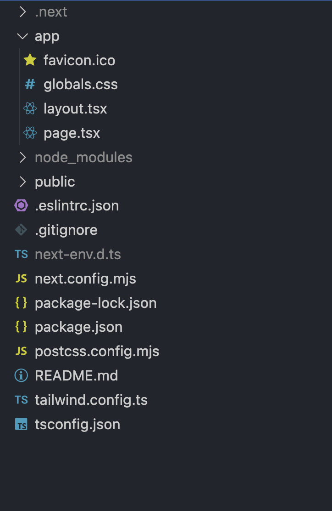

# ZenMD

## What

https://www.npmjs.com/package/zenmd

A convention-over-configuration static site generator, eliminating all boilerplate and framework setup (i.e.: accidental complexity[^1]), requires no decisions or input from the user, freeing them to focus solely on their content.

## Who

Crafted for the neurodivergent minimalist with ADHD/OCD, who can't remember all the reasons why config files can exceed the content.

## Why

It is an attempt in answering:

<blockquote class="twitter-tweet"><p lang="en" dir="ltr">How many steps does it take to publish markdown to a simple static blog with images and links between pages? 10? 20? Why not less than 5?</p>&mdash; Shao | 少蒙 (@randomor) <a href="https://twitter.com/randomor/status/1713069918252675531?ref_src=twsrc%5Etfw">October 14, 2023</a></blockquote>

With ZenMD, it's now just two steps:

1. `npx zenmd`
2. `netlify deploy` or whatever static hosting platform.

It transforms the following `@randomor` folder into the `dist` folder and properly link between them.

```markdown
├── @randomor
│   ├── WonderWeave Press.md
│   ├── assets
│   │   └── digital_garden.webp
│   ├── index.md
│   ├── posts
│   │   └── index.md
│   ├── zenjournal.md
│   └── zenmd.md
└── dist
├── assets
│   └── digital_garden.webp
├── index.html
├── posts
│   └── index.html
├── sitemap.xml
├── wonderweave-press.html
├── zenjournal.html
└── zenmd.html
```

## How is it different?

Started looking around, yet, no tool does this combination of things:

- With one command, transforms a folder of markdown files (usually takes more than a handful of steps).
- No extra config, no fluff and distractions that's not content.
- Supports internal links: `[another page](./another-link.md)`
- Supports wiki links: `[[another page]]`
- Supports images.
- Support dark/light mode with default layout.
- Allows custom layouts in multiple levels of directories.
- Layout support any value from frontmatter.
- Generates sitemap.xml

ZenMD fills the gap above, and also opens up a few interesting workflows:

- (Bring your own) BYO editor, note-taker
  - Tested with simple Obsidian vaults, VS Code (with Markdown Notes extension), Bear Notes exports.
- BYO static site host, Netlify, Vercel, or Cloudflare Pages
- BYO favorite frontend framework, let interactive pages be complex, but leave the content pages pure. Just add `&& npx zenmd posts -o public/posts` to your existing build step. That's how I generated [this](https://thezenjournal.com) site for ZenJournal.
- Back to the Future/Past, #nobuild, #noserver:
  - Preview the generated site by opening the `.html` pages directly, without an app server
  - html layout editing without a build process
- An out-of-the-box minimalist layout that support dark and light theme, using [SimpleCSS](https://simplecss.org/).

## What is this good for?

- Allow anyone to quickly transform their directory of markdown knowledge base or personal note vault into a digital garden.
- Create a simple wiki, using wiki links and GitHub as the CMS.
- For anyone to create a site in 30 seconds, using their existing markdown content.

## Footnotes

[^1]:
    Accidental complexity refers to complexity in software that arises from the tools or methods used, unlike essential complexity, which stems from the inherent demands of the problem itself. Accidental complexity is often considered avoidable or reducible. Just take a look at this default generated next.js app, you won't remember why 90% of these files are there in 5 years.
    
