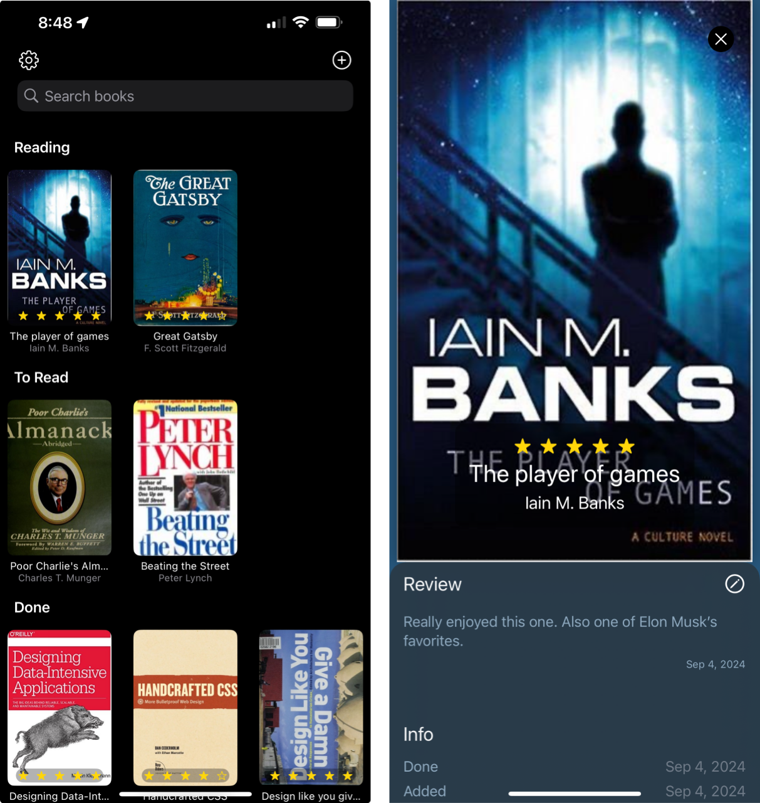

# The Making of ZenShelf with AI

## Why another book tracker app?

Over the past decade, Goodreads has barely changed since Amazon bought it. LibraryThing, while packed with features and an impressive book catalog, feels outdated, particularly on mobile. I used to love [Douban](https://douban.com), a Chinese platform that could have been a modern alternative to LibraryThing with its slick design and native apps. Sadly, it's no longer accessible due to China's strict internet identity rules.

As I rediscovered my love for reading, I sought a way to manage my library. I tried all the apps below.

These apps felt overwhelming, with screens full of empty lists, categories, trackers, timers, and persistent subscription popups. Yet, something still seemed to be missing.

On a Sunday night, I stumbled upon [OpenLibrary](https://openlibrary.org/) and their book search API. The next day, I asked Claude to create an iOS app featuring a grid of book covers and an ISBN camera scanner. Within an hour, I was using my phone to scan ISBN barcodes into a grid of books – it already felt useful.

Over the next two days, I collaborated with ChatGPT [^1] to generate the perfect icon. This process led me to the middle row below. I created v4 using Figma, but after seeing it on my phone, I realized it had too many details. Eventually, I arrived at v5.

When I shared the progress with my kids, they loved it and were eager to start using it to track their reading. Now, I'm motivated to get it on TestFlight and eventually ship this app.

## Where are we now?

After collaborating with Cursor and Claude, the app now offers:

- A sleek icon [^2]
- Book addition via title, author, ISBN, barcode scanning, and GoodReads import
- Cover grid with reading, to-read, and done sections
- Immersive book view with review feature
- Screenshot sharing for shelves and reviews
- Long-press status changes and book rating
- Shelf search and export (CSV/JSON)
- Bookshelf reset option
- iPhone and iPad support
- iCloud sync

### What's missing

The app currently lacks much onboarding features, but I'm hoping the interface is intuitive enough for users to get started without much guidance.

There's no way to add books without ISBNs or those not catalogued by OpenLibrary. However, this presents an opportunity to contribute to OpenLibrary – create an account, upload your cover there, and then import your books. We will be adding a way to manually add your own book and upload book cover directly in the future.

## What's next?

If you're a book lover looking to maintain a private digital bookshelf, you can help by installing ZenShelf via TestFlight and giving it a spin.

## Who am I?

I'm [a builder](/) with an obsession for simplicity. I've also created a minimalist journaling app called [[ZenJournal]].

## Footnotes

[^1]: The prompt was along the lines of "create a minimalist brand mark icon for a bookshelf app called ZenShelf," followed by requests for more options until finding the right one.
[^2]: I might be biased, but I believe it could be the best icon among all book trackers. It could still use some refinement, like improving the inner shadow or simplifying the pot details. However, I know I'm procrastinating if I spend a third day on these icons, no matter how enjoyable it was. I'm open to suggestions for improvement, though. Please DM me on X with your ideas.
