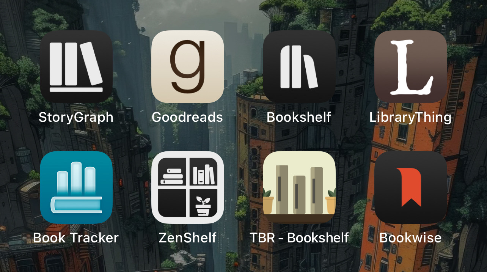
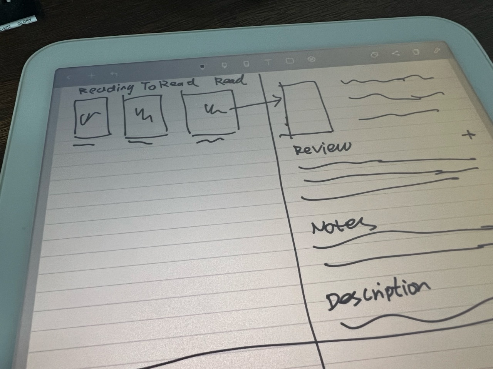
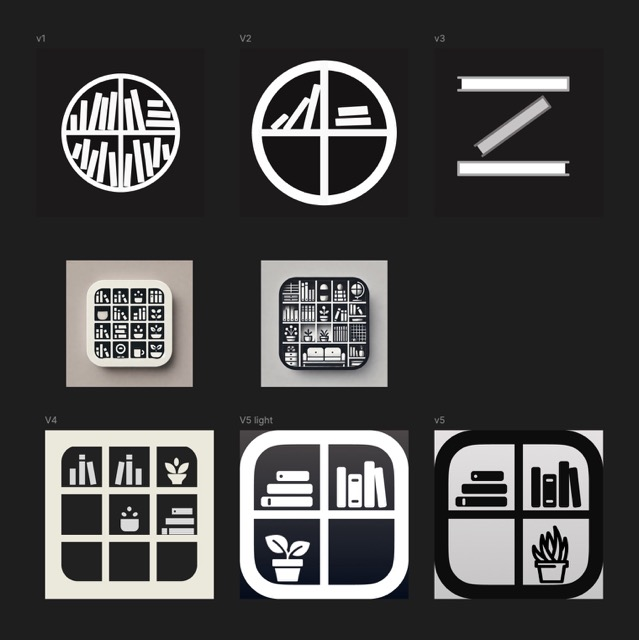
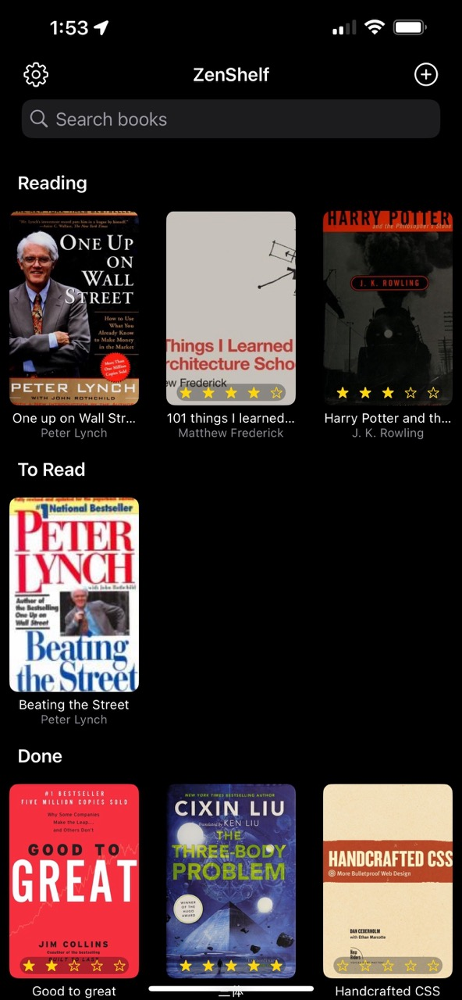

# The Making of ZenShelf with AI

## Why another book tracker app?

Over the past decade, Goodreads has barely changed since Amazon bought it. LibraryThing, while packed with features and an impressive book catalog, feels outdated, particularly on mobile. I used to love [Douban](https://douban.com), a Chinese platform that could have been a modern alternative to LibraryThing with its slick design and native apps. Sadly, it's no longer accessible due to China's strict internet identity rules.

As I rediscovered my love for reading, I sought a way to manage my library. I tried all the apps below.

These apps felt overwhelming, with screens full of empty lists, categories, trackers, timers, and persistent subscription popups. Yet, something still seemed to be missing.

Last Sunday night, I stumbled upon [OpenLibrary](https://openlibrary.org/) and their book search API. The next day, I asked Claude to create an iOS app featuring a grid of book covers and an ISBN camera scanner. Within an hour, I was using my phone to scan ISBN barcodes into a grid of books – it already felt useful.

Over the next two days, I collaborated with ChatGPT [^1] to generate the perfect icon. This process led me to the middle row below. I created v4 using Figma, but after seeing it on my phone, I realized it had too many details. Eventually, I arrived at v5.

When I shared the progress with my kids, they loved it and were eager to start using it to track their reading. Now, I'm motivated to get it on TestFlight and eventually ship this app.

## Where are we now?

After a few more days of intense collaboration with Cursor and Claude, we now have an app that:
- Sports a great icon [^2].
- Allows book searches by title, author, or ISBN, barcode scanning, and batch imports from GoodReads.
- Opens to a grid of book covers with three sections: reading, to read, and done.
	- Easily share your shelf with a simple screenshot.
- Enables marking books with different statuses via long-press on the covers.
- Includes a book rating feature.
- Offers shelf search functionality.
- Provides export options for your bookshelf in CSV or JSON format.
- Allows for bookshelf reset to start anew.
- Supports both iPhone and iPad.
- Syncs across devices via iCloud.

### What's missing

The core experience is centered around the grid of book covers; there isn't even a book detail view yet. I plan to add this later, but it won't be in the initial release as I want to make it truly engaging.
There's no way to add books without ISBNs or those not catalogued by OpenLibrary. However, this presents an opportunity to contribute to OpenLibrary – create an account, upload your cover there, and then import your books.
While planned, you can currently only rate books, not review them. However, when importing from GoodReads, your reviews will be included, saving you from future manual entry.
The app doesn't have a paywall or subscription. I need to research the market more to determine the best revenue model.

## What's next?

If you're a book lover looking to maintain a private digital bookshelf, you can help by installing ZenShelf via TestFlight and giving it a spin.

## Footnotes
[^1]: The prompt was along the lines of "create a minimalist brand mark icon for a bookshelf app called ZenShelf," followed by requests for more options until finding the right one.
[^2]: I might be biased, but I believe it could be the best icon among all book trackers. It could still use some refinement, like improving the inner shadow or simplifying the pot details. However, I know I'm procrastinating if I spend a third day on these icons, no matter how enjoyable it was. I'm open to suggestions for improvement, though. Please DM me on X with your ideas.