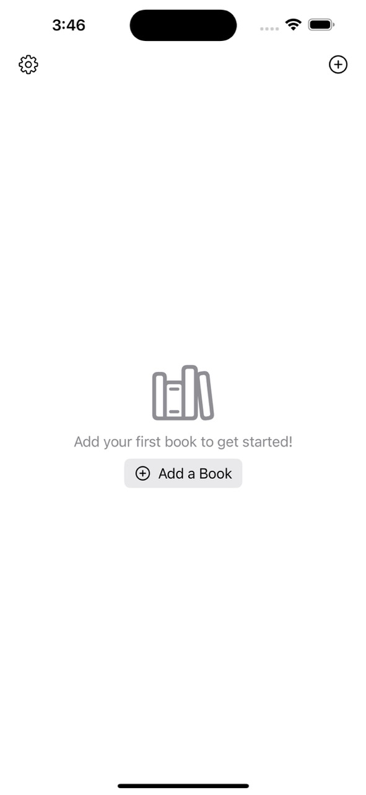
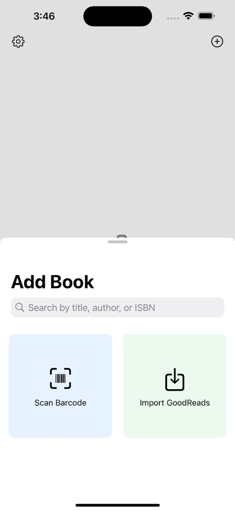
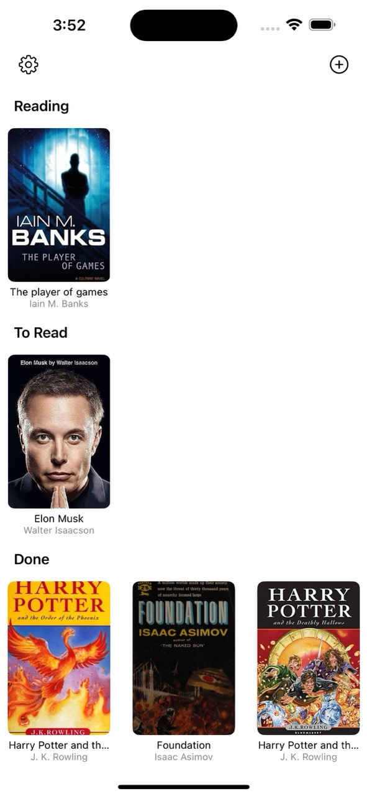
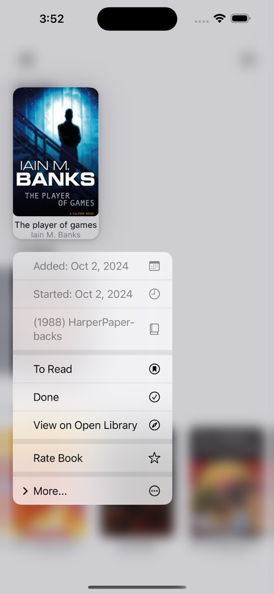
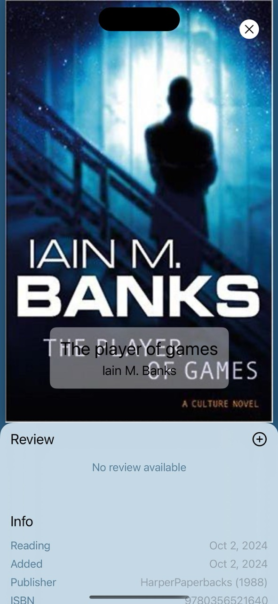

# How to ZenShelf

Zenshelf is a minimalist bookshelf app and we expect it to be intuitive enough to you. But here are some basic flows:

## Add a Book

Start by adding a book:

There are three ways to add: scanning a ISBN, search by title, author or ISBN, or import from GoodReads:

To export books from [GoodReads](https://help.goodreads.com/s/article/How-do-I-import-or-export-my-books-1553870934590)

## Mark a Book

You now have a growing virtual bookshelf.

You can start by long pressing on a book cover to mark them as reading, to read, or done, and a few other actions, including rate a book, or delete them (which is hidding behind the "More" submenu).

## Write a Review

Tap a book cover to see the book detail view, where you can also leave a review.

## Extra Stuff

You can also explore other settings in the settings view if you tap the gears icon. You can export your reading record as JSON or CSV. Or reset the app, or learn about the [Making of Zenshelf](./index.html) or [share some feedback](mailto:hi@idealistspace.com)
